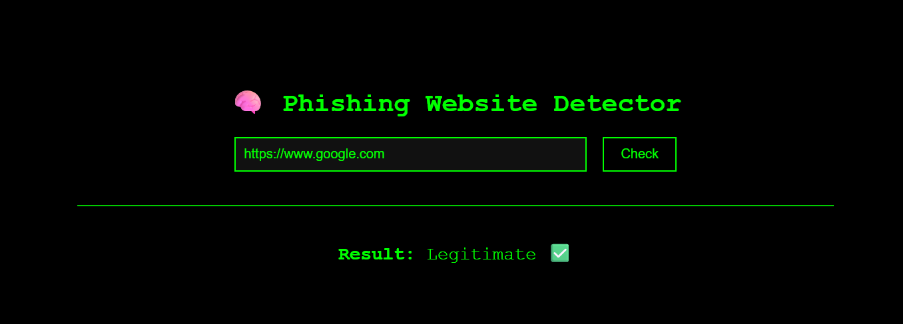
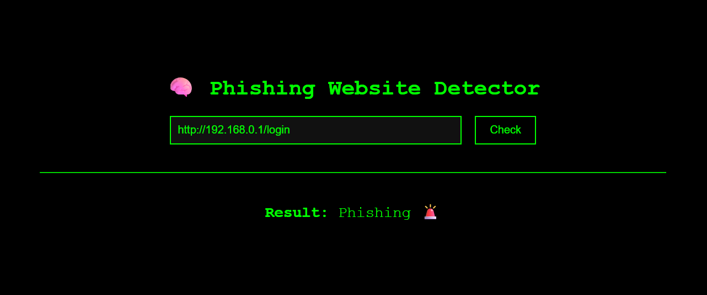

# PhishShield - Phishing Website Detector

A powerful phishing website detection tool built using Flask, Machine Learning, and the VirusTotal API. Designed with a sleek hacker-themed UI, it helps users check whether a URL is suspicious or safe in real-time.

---

## Features

- **Real-time Phishing Detection**
- **Hybrid Detection System** (Machine Learning + VirusTotal API)
- **URL Preview** before analysis
- **Dark Hacker UI** (black & green theme)
- **Detailed Scan Results**
- **Locally Trained Model** with intelligent heuristics

---

## How It Works

1. **User enters a URL**
2. The app:
   - Extracts and engineers features from the URL
   - Checks reputation using the [VirusTotal API](https://www.virustotal.com/)
   - Uses a **locally trained ML model** for prediction
3. Final verdict is shown to the user — **Phishing** or **Legitimate**

---

## Screenshot

>   
> *Legitimate URLs*
> 
> *Phishing URLs*

---

## Installation

### 1. Clone the repository
```bash
git clone https://github.com/Sundxr2005/PhishShield---A-Website-Phishing-Detector.git
cd PhishShield---A-Website-Phishing-Detector
